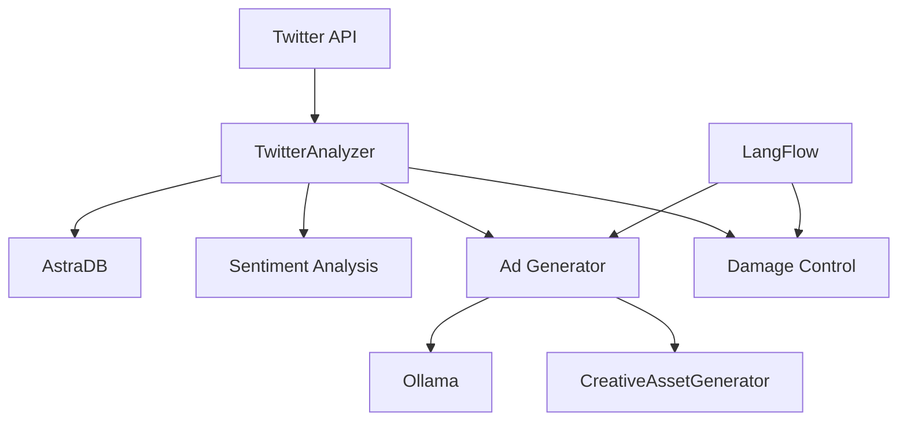

# Twitter Analysis and Response Tool (ART) 🚀

ART is a powerful social media analytics tool that combines sentiment analysis, damage control, and AI-powered ad generation to help businesses manage their Twitter presence effectively. Built with Streamlit and integrated with LangFlow, this tool provides real-time insights and automated response suggestions.

## 🌟 Features

### Sentiment Analysis
- Real-time Twitter data analysis
- Sentiment scoring and categorization
- Engagement metrics tracking
- Temporal sentiment trend analysis

### Damage Control
- Automatic detection of negative sentiment tweets
- Smart response suggestions
- Issue categorization (toxicity, misinformation, critical issues)
- One-click response actions

### AI-Powered Ad Generation
- Data-driven ad content creation using Ollama
- Visual ad previews with SVG generation
- Trend-based content suggestions
- Platform-specific optimization

### Data Management
- AstraDB integration for tweet storage
- Export capabilities to CSV
- Real-time data visualization
- Historical data analysis

## 🔧 Prerequisites

- Python 3.8+
- Twitter API credentials
- AstraDB account
- Ollama installed locally
- LangFlow installation

## 📦 Installation

1. Clone the repository:
```bash
git clone https://github.com/yourusername/twitter-art.git
cd twitter-art
```

2. Install required packages:
```bash
pip install -r requirements.txt
```

3. Set up environment variables in `.env`:
```env
TWITTER_API_KEY=your_api_key
TWITTER_API_SECRET=your_api_secret
TWITTER_ACCESS_TOKEN=your_access_token
TWITTER_ACCESS_TOKEN_SECRET=your_access_token_secret
TWITTER_BEARER_TOKEN=your_bearer_token
ASTRA_TOKEN=your_astra_token
ASTRA_API_ENDPOINT=your_astra_endpoint
ASTRA_KEYSPACE=your_keyspace
```

## 🚀 Usage

1. Start the Streamlit app:
```bash
streamlit run app.py
```

2. Enter your company information in the sidebar:
   - Company name
   - Industry type
   - Target audience
   - Key selling points
   - Target platforms

3. Configure your search query and tweet limit

4. Click "Analyze" to start processing

## 📊 Dashboard Sections

### 1. Insights
- Overview metrics
- Engagement statistics
- Trend analysis

### 2. Sentiment Analysis
- Sentiment distribution
- Sentiment gauge
- Temporal trends

### 3. Damage Control
- Negative tweet monitoring
- Response suggestions
- Action buttons

### 4. AI Ad Suggestions
- Generated ad content
- Visual previews
- Platform-specific recommendations

### 5. Raw Data
- Complete dataset view
- CSV export option

## 🔄 LangFlow Integration

This project uses LangFlow for enhanced AI capabilities:

1. Start LangFlow:
```bash
langflow run
```

2. Import the provided flow configuration:
```bash
langflow import flow.json
```

3. Connect to the LangFlow API endpoint in the app settings

## 🛠 Architecture



## 🤝 Contributing

1. Fork the repository
2. Create a feature branch
3. Commit your changes
4. Push to the branch
5. Open a Pull Request

## 📝 License

This project is licensed under the MIT License - see the [LICENSE](LICENSE) file for details.

## 🙏 Acknowledgments

- Twitter API
- DataStax Astra DB
- Ollama
- LangFlow
- Streamlit community

## 💡 Future Improvements

- [ ] Multi-platform social media integration
- [ ] Advanced ML models for sentiment analysis
- [ ] Automated response deployment
- [ ] Custom visual asset generation
- [ ] Enhanced trend detection
- [ ] API endpoint for external integration

## ⚠️ Troubleshooting

Common issues and solutions:

1. Twitter API Rate Limits:
   - Implement exponential backoff
   - Use cursor-based pagination

2. AstraDB Connection:
   - Verify credentials
   - Check network connectivity
   - Ensure proper keyspace configuration

3. Ollama Integration:
   - Confirm local installation
   - Check port availability
   - Verify model availability


Made with No by [Your Name]